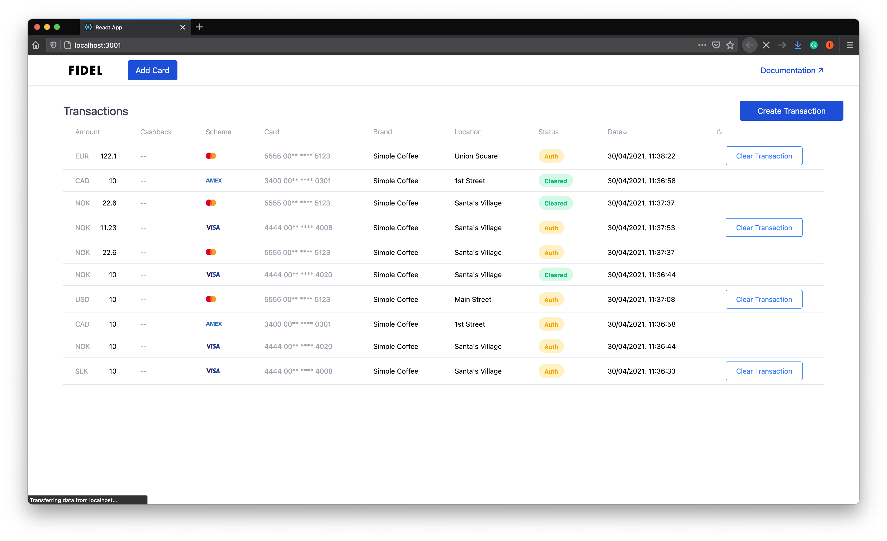

# Sample Application for Using the Fidel API and Web SDK

The application in this repository implements:
- a Node.js Server that listens for webhook events coming from Fidel and passes them on to a WebSocket and provides an authentication layer for calling various Fidel APIs.
A React Client that receives transactions from the server via a WebSocket, can create test transactions using the server and Fidel APIs and link cards using the Fidel Web SDK.



If you want to run it locally, please start by cloning the repo to your local environment:

```sh
$ git clone git@github.com:FidelLimited/fidel-api-sample-app.git
```

## Requirements

You'll need a few things before you can run this sample application locally:
- [Node.js](https://nodejs.org/en/) v12.22+.
- [ngrok](https://ngrok.com/download) downloaded and installed (it might also ask you to sign up for an account in the process).
- [A Fidel Account](https://dashboard.fidel.uk/sign-up?ref=github-sample).

## Getting Started

### Run ngrok

We are using `ngrok` to expose our locally running application server to the Fidel platform without deploying it in a hosted environment. After you've downloaded and installed `ngrok`, you'll need to run it on port 3000 because the application server is listening on that particular port.

```sh
$ ./ngrok http 3000
```

ngork will give you a random-looking ngrok.io URL, similar to `https://98c1bcdc8042.ngrok.io`. Please make a note of it. You will use it to register webhooks in the [Fidel Dashboard](https://dashboard.fidel.uk/webhooks).

### Register Webhooks

After you've signed up for a Fidel account, you'll notice it comes with demo data in a test sandbox. Your account has a "Demo Program", which we'll use with this sample application. We'll register webhooks on the demo program in the [Fidel Dashboard](https://dashboard.fidel.uk/programs). If you click on the program name on the main screen, you'll see a "Webhooks" option appear on the side menu. Choosing that option will take you to the [Webhooks](https://dashboard.fidel.uk/webhooks) screen, where you can register a "New webhook".

This application server implements a generic catch-all webhook route in `/api/webhooks/:type`. By appending the ngrok URL you got earlier, you can register any of the webhooks supported in the Fidel Dashboard.

We recommend you register at least 2 webhooks, `transaction.auth` and `transaction.clearing`, the sample application client in this repository is using them. The Webhook URLs should be similar to `https://98c1bcdc8042.ngrok.io/api/webhooks/transaction.auth` and `https://98c1bcdc8042.ngrok.io/api/webhooks/transaction.clearing`.

### Run the Application

First, let's install the project dependencies for the client:

```sh
$ npm install
```

And the server:

```sh
$ cd server
$ npm install
$ cd ../
```

Then, we'll need to create an environment file and populate the Fidel API Key and Fidel SDK Key. 

```sh
$ cp example.env .env
```
Add your Fidel Test keys in the newly created `.env` file. You'll find both keys in the [Account page of the Fidel Dashboard](https://dashboard.fidel.uk/account/plan). Please use the Test keys. They'll start with `sk_test_` for the API key and `pk_test_` for the SDK key.

That's it, you're ready to run the sample application:

```sh
$ npm start
```

## Use the Application

After you've run the sample application, a browser window will open to http://localhost:3001/. You can add cards, create transactions, and see transactions appear in real-time in the UI. You can also clear authorized transactions in the same UI.