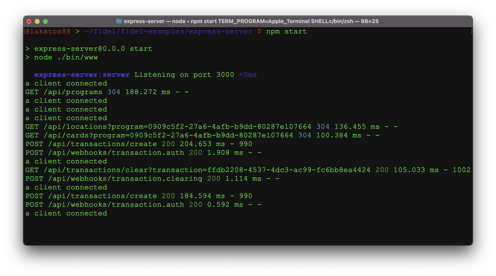

# express-server
Example server for implementing with the Fidel API using Node.js, Express, Socket.io and Axios.

To run the server:

1. `npm install`
2. `cp example.env .env`
3. Add your Fidel Test API Key in the newly created `.env` file. You can find it in your [Fidel Dashboard](https://dashboard.fidel.uk/account/plan).
4. `npm start`

The server implements a generic catch-all webhook route in `/api/webhooks/:type`. The events received on the webhook are passed on to any client listening via Socket.io.

To receive Webhook events from the Fidel API, you need to expose this server running locally to the outside world, so the Fidel API can access it. We recommend doing that with [ngrok](https://ngrok.com/download) or something similar. After you've downloaded ngrok, please run it on port 3000, this server also runs on port 3000.

`./ngrok http 3000`

ngork will give you a random-looking ngrok.io URL, similar to `https://98c1bcdc8042.ngrok.io`. Please use it to register webhooks in the [Fidel Dashboard](https://dashboard.fidel.uk/webhooks). We recommend you register at least 2 webhooks, `transaction.auth` and `transaction.clearing`, the example clients in this repository are using them. The Webhook URLs should be similar to `https://98c1bcdc8042.ngrok.io/api/webhooks/transaction.auth` and `https://98c1bcdc8042.ngrok.io/api/webhooks/transaction.clearing`.

This server also implements routes for:
 - `GET` `/api/cards/?program=id`
 - `GET` `/api/locations?program=id`
 - `GET` `/api/programs`
 - `GET` `/api/transactions/cleat?transaction=id`
 - `POST` `/api/transactions/create`, expecting a body of `{ amount: number, location: "id", card: "id" }`
